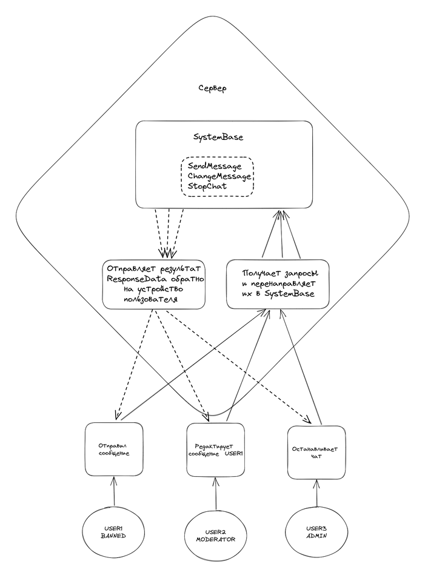

# Bizzare Chat

У вас есть приложение, а в нем пользователи. У каждого пользователя есть свой уникальный `id`. Приложение - обычный мессенджер, а ваш класс будет управлять чатом. Взаимодействие с классом будет следующее, он извне получает запросы об изменении состояния чата(добавление пользователя, новые сообщения, бан пользователей и т.п.). У каждого из этих запросов есть отправитель, конкретный пользователь со своим `id`. Дело в том, что в чатах обычно есть роли пользователей, поэтому, скажем, удалять сообщения других людей могут только модераторы, а добавлять в чат новых людей могут только админы.

Список ролей у пользователей:
|Роль|Описание|
|:--:|:--:|
|ADMIN|Может регистрировать новых пользователей, давать роль админа или модератора другим пользователям, а также полностью останавливать чат|
|MODERATOR|Может банить пользователей, создавать других модераторов, а также полностью редактировать все сообщения|
|BANNED|Не может ничего, предполагается, что ни ADMIN, ни MODERATOR не станут BANNED|
|USER|Может писать сообщения, а также редактировать сообщения, но только свои|

Более того, любые запросы к пользователю, котрого еще нет в чате, также невозможны(Например, нельзя забанить того, кого нет в чате). Также нельзя повторять запросы, если они не имеют смысла(например, остановить остановленный чат или же забанить того, кто уже забанен)

Как можете видеть, один и тот же пользователь в праве иметь несколько ролей сразу. Например, `ADMIN`, `MODERATOR`, `USER`.

Итак, у каждого запроса есть отправитель.

Также на каждый запрос ваш класс должен возвращать ответ в следующем виде:

```c++
struct ResposeData {
    bool Success;
    std::string Response;
};
```
Где `Success` -- выполнил ли класс запрос. `Response` -- комментарий класса об ошибке, если `Success` равен `false`

Итак, вас попросили написать класс со следующими методами. Везде `sender`, это отправитель запроса. В конструкторе единственный аргумент, id самого первого админа.

```c++
class SystemBase {
public:
    SystemBase(int admin);
    ResposeData BanUser(int sender, int user);
    ResposeData UnBanUser(int sender, int user);
    ResposeData RegisterNewUser(int sender, int newUser);
    ResposeData GrantModeratorRole(int sender, int user);
    ResposeData GrantAdminRole(int sender, int user);
    ResposeData StopChat(int sender);
    ResposeData ResumeChat(int sender);
};
```

При этом, если запрос некорректен, например, метод `GrantAdminRole` вызван от `sender`, который сам не является админом, то такой метод в `ResponseData` должен иметь `Success = false`, комментарий не важен.

## Внешний вид всей системы



## Пример работы:
```c++
void PrintResponse(const ResposeData& response) {
    std::cout << "result: " << response.Success << "\nresponse: " << response.Response << "\n";
}

int main() {
    const int USER1 = 1;
    const int USER2 = 2;
    const int USER3 = 3;
    SystemBase chat(1);

    auto responseRegisterFromAdmin1 = chat.RegisterNewUser(USER1, USER2);
    PrintResponse(responseRegisterFromAdmin1);
    auto responseRegisterFromAdmin2 = chat.RegisterNewUser(USER1, USER2);
    PrintResponse(responseRegisterFromAdmin2);
    auto responseGrantFromAdmin = chat.GrantModeratorRole(USER1, USER2);
    PrintResponse(responseGrantFromAdmin);
    auto responseRegisterFromModerator = chat.RegisterNewUser(USER2, USER3);
    PrintResponse(responseRegisterFromModerator);
    auto responseRegisterFromAdmin3 = chat.RegisterNewUser(USER1, USER3);
    PrintResponse(responseRegisterFromAdmin3);
    auto responseBanFromModer = chat.BanUser(USER2, USER3);
    PrintResponse(responseBanFromModer);
    auto responseStopFromModer = chat.StopChat(USER2);
    PrintResponse(responseStopFromModer);
    auto responseStopFromAdmin = chat.StopChat(USER1);
    PrintResponse(responseStopFromAdmin);
}
```
Вывод:
```
result: 1
response: 
result: 0
response: already registered
result: 1
response: 
result: 0
response: only admin can register
result: 1
response: 
result: 1
response: 
result: 0
response: only admin can stop chat
result: 1
response: 
```

Тот, кто попросил вас написать этот класс считает, что в `ResposeData` сам `Response` может быть любыми, главное, чтобы `Success` был корректным. Т.е. вывод в примере после `response: ` может быть любым


_Указания_:

Реализуйте логику выдачи ролей пользователям в отдельном классе `AccessControl`.
Реализуйте логику остановки чата в отдельном классе `Pausable`. Слова `реализуйте логику` означают, что ни `AccessControl`, ни `Pausable` ничего не знают про класс `SystemBase` и уже самодостаточны. Классу `SystemBase` необходимо лишь наследоваться от этих двух классов, чтобы включить в себя их функционал.

В систему отправляйте лишь код полученных классов. Главное, чтобы  ваш `SystemBase` соответствовал интерфейсу, указанному выше

Для вашего удобства все ResposeData.Response, которые выдает ваш класс также выводятся в поток `std::cerr`, поэтому для отладки ошибок можете смотреть его в отчете
