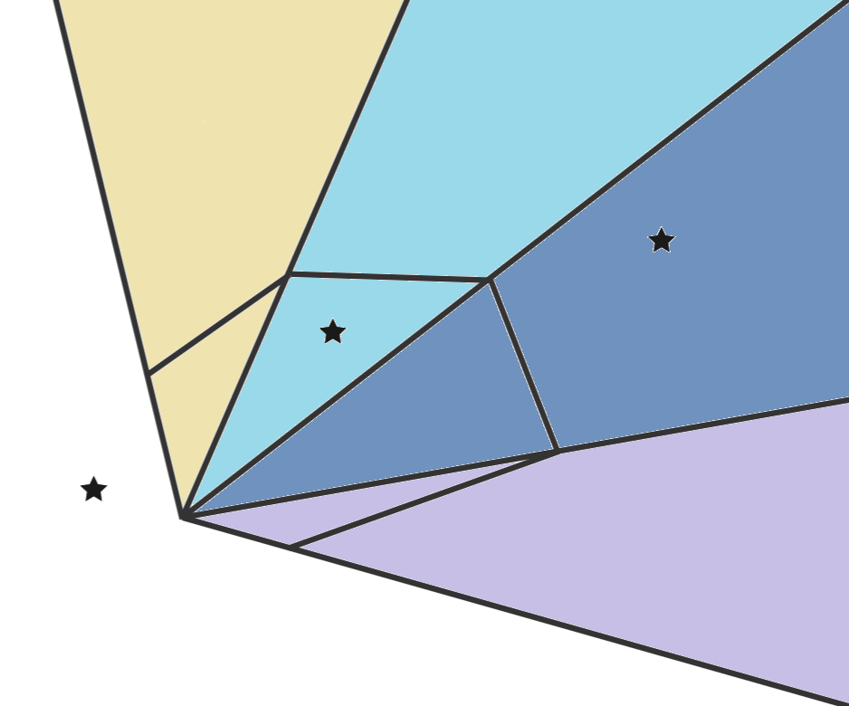

```
Многоугольники. Виды, хранение и обход
Лежит ли точка в многоугольнике
Лежит ли точка в выпуклом многоугольнике
Площадь многоугольника
Пересечение окружностей
```

Какие есть виды:

Выпуклые, невыпуклые. Простые. С самопересечениями. Нас в основном будут интересовать первые 2 типа.

Хранят обычно в векторе/массиве, обходят в том порядке, в котором он дан(если это не задача на выпуклую оболочку)

-------

[более подробное описание части алгоритмов](https://habr.com/ru/articles/169317/)

-------

Лежит ли точка в многоугольнике:

1. [часть с произвольным многоугольником](https://wiki.algocode.ru/index.php?title=%D0%9F%D1%80%D0%B8%D0%BD%D0%B0%D0%B4%D0%BB%D0%B5%D0%B6%D0%BD%D0%BE%D1%81%D1%82%D1%8C_%D1%82%D0%BE%D1%87%D0%BA%D0%B8_%D0%BC%D0%BD%D0%BE%D0%B3%D0%BE%D1%83%D0%B3%D0%BE%D0%BB%D1%8C%D0%BD%D0%B8%D0%BA%D1%83)

По ссылке предлагается пустить горизонтальный луч. Однако, можно пускать луч в произвольном направлении, даже в случайном. В таком случае велика вероятность того, что луч не пересечется с вершиной многоугольника, поэтому вычисления будут проще. (можно пустить луч в направлении вектора с достаточно большими координатами, которые являются простыми числами).

2. Пусть координаты многоугольника размера $n$ лежат в $p$. Сама точка - $x$. Можно посчитать $\sum^{n}_{i=1} \angle (x, p[i])$. Т.е. мы считаем сумму всех поворотов. Если точка не лежит внутри, то эта сумма будет равна $0$, иначе некоторому числу, кратному $\pi$. Время $O(n)$.

--------

Лежит ли точка в выпуклом многоугольнике:

Картинка к решению (звездочки - точки)



[первая часть](https://wiki.algocode.ru/index.php?title=%D0%9F%D1%80%D0%B8%D0%BD%D0%B0%D0%B4%D0%BB%D0%B5%D0%B6%D0%BD%D0%BE%D1%81%D1%82%D1%8C_%D1%82%D0%BE%D1%87%D0%BA%D0%B8_%D0%BC%D0%BD%D0%BE%D0%B3%D0%BE%D1%83%D0%B3%D0%BE%D0%BB%D1%8C%D0%BD%D0%B8%D0%BA%D1%83)

[тот же алгоритм, но другими словами](https://neerc.ifmo.ru/wiki/index.php?title=%D0%9F%D1%80%D0%B8%D0%BD%D0%B0%D0%B4%D0%BB%D0%B5%D0%B6%D0%BD%D0%BE%D1%81%D1%82%D1%8C_%D1%82%D0%BE%D1%87%D0%BA%D0%B8_%D0%B2%D1%8B%D0%BF%D1%83%D0%BA%D0%BB%D0%BE%D0%BC%D1%83_%D0%B8_%D0%BD%D0%B5%D0%B2%D1%8B%D0%BF%D1%83%D0%BA%D0%BB%D0%BE%D0%BC%D1%83_%D0%BC%D0%BD%D0%BE%D0%B3%D0%BE%D1%83%D0%B3%D0%BE%D0%BB%D1%8C%D0%BD%D0%B8%D0%BA%D0%B0%D0%BC)


----------

Площадь многоугольника мы уже затрагивали. Это можно делать с помощью векторного произведения. Конечно, оно определено для $R^3$, но длина результирующего вектора как раз будет удвоенной площадью искомого треугольника

[ссылка](https://wiki.algocode.ru/index.php?title=%D0%9F%D0%BB%D0%BE%D1%89%D0%B0%D0%B4%D1%8C_%D0%BC%D0%BD%D0%BE%D0%B3%D0%BE%D1%83%D0%B3%D0%BE%D0%BB%D1%8C%D0%BD%D0%B8%D0%BA%D0%B0).

Стоит заметить, что суммировать модули треугольников нельзя, тк никто не гарантирует, что многоугольник выпуклый. Но в ссылке это описано.

-----------

Пересечение окружностей

Здесь просто работа с планиметрией и скалярными произведениями

[ссылка](https://wiki.algocode.ru/index.php?title=%D0%9E%D0%BA%D1%80%D1%83%D0%B6%D0%BD%D0%BE%D1%81%D1%82%D0%B8)

